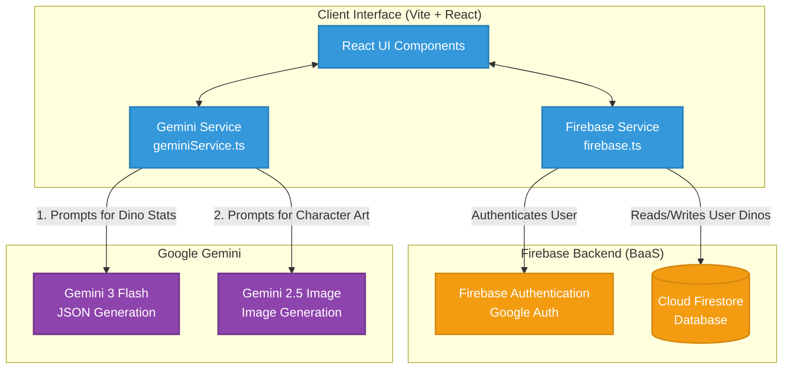

# Run and deploy your AI Studio app

This contains everything you need to run your app locally.

View your app in AI Studio: https://ai.studio/apps/7f360f2d-e7f3-4a5e-9a4c-e74d5934593a

## Run Locally

**Prerequisites:**  Node.js

1. Install dependencies:
   `npm install`
2. Set the `GEMINI_API_KEY` in [.env.local](.env.local) to your Gemini API key
3. Run the app:
   `npm run dev`

## DinoQuest Architecture
The DinoQuest application operates seamlessly using a single-page application (SPA) architecture combined with cloud-based Backend-as-a-Service (BaaS) and AI services. Below is the high-level architecture diagram.

Core Components
- Client Application (Vite + React): Handles the user interface, routing, and user interactions.
- Firebase Authentication: Leverages Google Provider (signInWithPopup) to ensure users can securely sign in and manage their collections.
- Cloud Firestore: A NoSQL cloud database storing connection states and saved user-generated dinosaurs.
- Google Gen AI (Gemini):
  - Generates the text-based attributes and stats of a dinosaur using the gemini-3-flash-preview model.
  - It also manages image generation for the dinosaurs with gemini-2.5-flash-image and compresses the base64 responses locally via the HTML5 canvas before they are managed by the application.

# FOR MCP SETUP 

gcloud services enable \
        developerknowledge.googleapis.com \
        bigquery.googleapis.com \
        bigquerydatatransfer.googleapis.com \
        logging.googleapis.com \
        monitoring.googleapis.com \
        run.googleapis.com \
        sqladmin.googleapis.com \
        cloudtrace.googleapis.com \
        clouderrorreporting.googleapis.com \
        firestore.googleapis.com \
        chronicle.googleapis.com \
        redis.googleapis.com \
        cloudresourcemanager.googleapis.com \
        aiplatform.googleapis.com